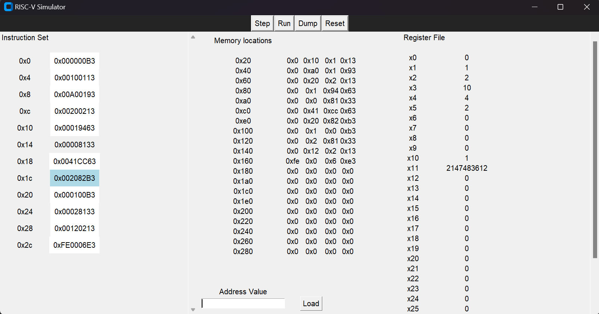

# RISC-V Simulator
##### _An application to simulate the execution of machine code in RISC-V ISA_
##### _This repository contains a RISC-V Simulator written in Python that can execute RISC-V code._
#

```
Contributors:
Alankrit Kadian      :- 2021CSB1065
Aditya Dinesh Patil  :- 2021CSB1062
Prashant Singh       :- 2021CSB1124
Nakul R. Alawadhi    :- 2021CSB1111
```

### Instructions Supported
```
R format - add, and, or, sll, slt, sra, srl, sub, xor
I format - addi, andi, ori, lb, lh, lw, jalr
S format - sb, sw, sh
SB format - beq, bne, bge, blt
U format - auipc, lui
J format - jal
```


## Run Locally

Clone the project

```bash
  git clone https://github.com/alankritkadian/CS204-Project-RISC-V-Simulator
```

Go to the project directory

```bash
  cd CS204-Project-RISC-V-Simulator/
```

Install dependencies

```bash
  pip install customtkinter
  pip install bitarray
```

Run the project

```bash
  python main.py
```


Image:
GUI Window


----
## Project Description

- We have implemented a RISC-V single cycle processor.
- We have used many object oriented programming concepts and implemented a processor with alu , control unit and memory mocking the working of of a processor in exact same way which makes our code much more readable and intuitive. All of this combined with a gui.

- First we created a window gui with help of tkinter and linked the button commands to that of the processor.
- FETCH, we have a method of processor object fetch, it fetches the instruction from the data.mc file
- DECODE, a object of Instruction is created and we get access to all attributes of Instructions.
- EXECUTE,
ALU does its calculation and is used to determine the value of muxselect of the mux deciding PC, and the data is made available to memory.

- Memory Access,
Memory is written or accessed according to the type of instruction.

- Write Back, in the write back stage we are writing the value in destination register.

## Authors

- [@Aditya Patil](https://www.github.com/Nerditya)
- [@Alankrit Kadian](https://www.github.com/alankritkadian)
- [@Prashant Singh](https://www.github.com/prashant531)
- [@Nakul Alawadhi](https://www.github.com/nakul-NRA)
